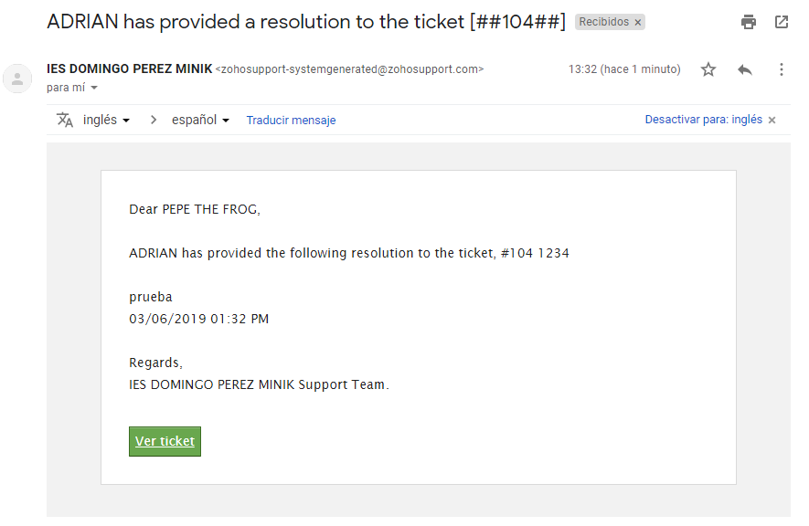

**ZOHO DESK**

Primer paso registro

Seleccionamos comenzar

Nos vamos a la parte clientes y le damos a el símbolo + para añadir un cliente

Y rellenamos la información del contacto

Y tendremos a nuestro cliente creado

Y si pulsamos en el podemos ver toda la información

Le añadimos un ticket al cliente

Y rellenamos el ticket

Y en las notificaciones se nos muestra que se ha creado

Ahora si nos vamos a la parte de tickets/fuentes podemos añadir comentarios,
responder al ticket o cerrarlo.

Y si pulsamos sobre el ticket, podemos añadir una resolución o

En la cual podemos asistir remotamente a los clientes

En la cual nos tenemos que descargar el programa que nos indica

Y al cliente le llegará un correo en el cual solo tenemos que abrir el enlace

Y si nos vamos a la sección informes podemos ver unas graficas de los tickets

Y ofrece informes y personalización de estos

Por ejemplo tickets por cuenta en el cual podemos ver todos los tickets de las
cuentas y podemos aplicar filtros etc.

Podemos añadir una resolución a un ticket y marcar que notifique al cliente

Y al cliente le llegará al correo

Los clientes pueden enviar tickets en
<https://desk.zoho.eu/portal/iesdomingoperezminik/home> en la parte de tickets

Y vemos que el ticket se ha creado en la administración

Cuenta con una parte de centro de asistencia en la cual podemos ir creando pasos
para resolver problemas etc

Y luego el cliente en la parte de helpcenter lo puede ver

Y en el centro de actividades podemos programar llamadas, tareas o eventos

También tiene un chat para los clientes en el cual desde el cliente solicitamos
asistencia

Y un administrador podrá aceptar la asistencia o no

Y en los ajustes podemos configurar mucho más

